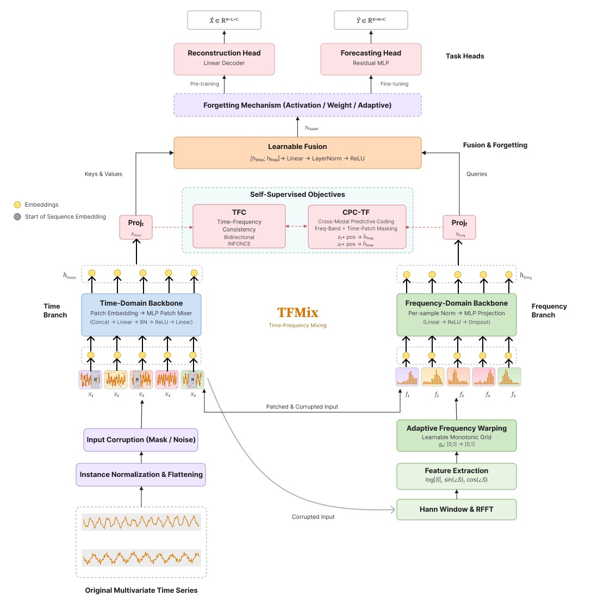
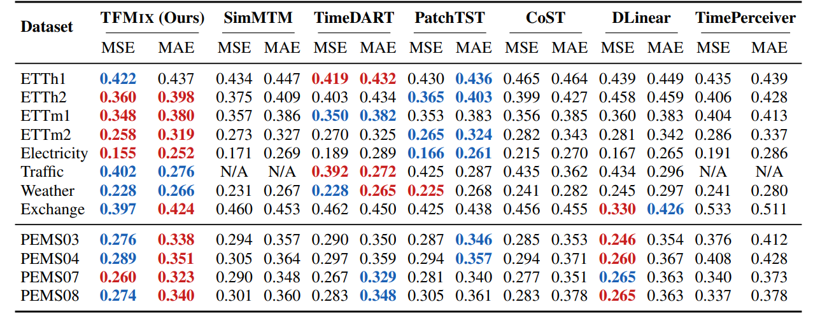

# TFMIX: Lightweight Dual-Domain Pre-Training for Time Series Forecasting

[](https://opensource.org/licenses/MIT)
[](https://neurips.cc/)

This is the official PyTorch implementation for the paper **TFMIX: Lightweight Dual-Domain Pre-Training for Time Series Forecasting with Adaptive Frequency Warping and Post-Pretraining Forgetting** (NeurIPS 2026).

## Abstract

Self-supervised pre-training has become a compelling paradigm for time-series analysis, yet most methods commit to a single representational domain, either temporal or spectral, and couple it with heavyweight Transformer or diffusion stacks, which limits deployment efficiency and transfer across horizons.

We propose **TFMIX**, a lightweight self-supervised framework that unifies temporal and spectral modelling through a dual-backbone architecture with only a fraction of the parameters of Transformer-based baselines. By replacing Transformer encoders with simple MLP-based components, TFMIX achieves up to 8x parameter reduction while maintaining competitive accuracy.

## Model Architecture



TFMIX combines three core innovations:

- **Dual-Domain Backbones**: A patch-based MLP mixer that aggregates overlapping patches into a global temporal representation, combined with a frequency encoder that applies windowed FFT to extract spectral features including log-amplitude and trigonometric phase components.
- **Adaptive Frequency Warping (AFW)**: A lightweight, monotonic, cumulative-softplus parameterisation that learns a task-adapted reindexing of FFT bins via bilinear interpolation on a learnable grid, adding fewer than $M$ scalar parameters.
- **Time-Frequency Consistency & Forgetting**: A learnable fusion head that is aligned across domains by a symmetric cross-modal InfoNCE objective adapted from time-frequency consistency. For downstream adaptation, we further introduce a post-pretraining forgetting module supporting activation-gated, weight-gated, and adaptive variants that suppress pre-training-specific features that do not transfer to long-horizon forecasting.

## Main Results

Across twelve public forecasting benchmarks, TFMIX matches or surpasses strong self-supervised (SimMTM, TimeDART) and supervised (PatchTST, DLinear) baselines, attaining the lowest MSE and MAE on six datasets (ETTh2, ETTm1, ETTm2, Electricity, PEMS07, and Exchange).



**Parameter Efficiency:** At $H=720$ on the Exchange dataset, TFMIX requires only 4.72 M fine-tuning parameters, compared to 15.88 M for TimeDART and 31.23 M for SimMTM.

## Getting Started

### Environment Setup

The code was developed and tested using PyTorch.

```bash
conda create -n tfmix python=3.10
conda activate tfmix
pip install -r requirements.txt
```

### Data Preparation

We evaluate on 12 standard benchmarks spanning energy, weather, financial, and traffic domains:

- ETT datasets: ETTh1, ETTh2, ETTm1, ETTm2
- Electricity, Traffic, Weather, Exchange
- PEMS traffic datasets: PEMS03, PEMS04, PEMS07, PEMS08

Place the downloaded datasets into the `./dataset/` directory.

### Usage

All experimental scripts can be found in the `./scripts/` directory. We use a channel-independent strategy where the normalized batch is reshaped as $X_{flat} \in \mathbb{R}^{(B\cdot C)\times L}$ and all subsequent operations apply identically to each univariate instance.

#### Pre-training

To pre-train TFMIX on the ETTh1 dataset using the default hyperparameters:

```bash
python run_pretrain.py \
  --dataset ETTh1 \
  --seq_len 336 \
  --d_model 128 \
  --patch_len 16 \
  --stride 8 \
  --tfc_weight 0.05 \
  --mask_ratio 0.4 \
  --batch_size 16 \
  --train_epochs 50
```

#### Fine-tuning

To fine-tune the pre-trained model for long-horizon forecasting, for example $H=96$:

```bash
python run_finetune.py \
  --dataset ETTh1 \
  --seq_len 336 \
  --pred_len 96 \
  --d_model 128 \
  --forgetting_type activation \
  --forgetting_rate 0.15 \
  --batch_size 16 \
  --train_epochs 10 \
  --pretrained_ckpt ./checkpoints/pretrain_ETTh1.pth
```

For PEMS datasets, the standard look-back window is $L=36$ with horizons $H \in \{12, 24, 36, 48\}$.

## Citation

If you find this repository useful for your research, please consider citing our paper:

```bibtex
@inproceedings{tfmix2026,
  title={TFMIX: Lightweight Dual-Domain Pre-Training for Time Series Forecasting with Adaptive Frequency Warping and Post-Pretraining Forgetting},
  author={Anonymous},
  booktitle={Advances in Neural Information Processing Systems (NeurIPS)},
  year={2026}
}
```

## Acknowledgements

We build upon the excellent codebases of PatchTST, SimMTM, and TimeDART. We thank the authors for open-sourcing their work.